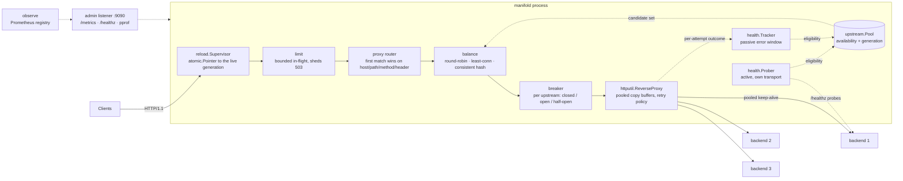

# manifold

An L7 HTTP load balancer in Go — path/header routing across upstream pools, with health checking, per-upstream circuit breaking, bounded in-flight backpressure, and benchmarks measured against nginx on identical pinned hardware.

An intake manifold splits one flow across many outlets. So does this.

> **Status: complete.** Everything below is built, tested, and measured. Distributed tracing is the one planned item deliberately not built — see the roadmap note. The benchmark numbers come from a committed run whose raw output is in this repository, and the limitations section says plainly what they do and do not establish.

---

## Architecture



The data plane and the admin plane are separate listeners: `/metrics` and pprof are never reachable from whatever can reach the proxy, and admin traffic never lands in the benchmark numbers.

Health checking never touches the request path. The prober and the passive tracker both write eligibility into `upstream.Pool`, which bumps a generation counter; the balancer receives an already-filtered candidate set and caches derived structures against that generation.

## What works today

```
$ curl -sD - http://localhost:8080/hello | grep -i manifold
X-Manifold-Upstream: http://127.0.0.1:9002
```

- **L7 routing** — first-match-wins rules over host, path prefix, method, and headers, mapping requests to named upstream pools.
- **Three balancing strategies** — weighted round-robin and least-connections on a lock-free pick path, plus consistent hashing with virtual nodes for session affinity.
- **Active health checking** — out-of-band probes on their own transport, with configurable interval, timeout, and consecutive-success/failure thresholds.
- **Passive ejection** — a sliding error-rate window over real traffic, so a backend that answers `/healthz` but fails actual requests is still removed. Automatic readmission after a cooldown.
- **Retry policy** that is narrow on purpose: connection-level failures only, idempotent methods only, only before a byte has reached the client, only when the body is replayable, and never onto a backend already tried.
- **Per-upstream circuit breaking** — closed/open/half-open, with a strictly enforced half-open probe budget, held in a single atomic word.
- **Bounded in-flight backpressure** — a per-pool concurrency cap that sheds with 503 rather than queueing without limit.
- **Hot config reload** — SIGHUP or optional file watching, with an atomic swap and a bounded drain of the previous generation. A bad config is rejected and the running proxy keeps serving.
- **Prometheus metrics** on the admin listener — request and upstream counters, a latency histogram bucketed for this proxy's actual p50 and p99, live in-flight and availability gauges.
- **Graceful drain** on SIGINT/SIGTERM with a bounded deadline.
- **Config validation** that reports every problem at once with YAML paths, rejects unknown keys at any nesting depth, and distinguishes an omitted key from one explicitly set to zero or false.
- **Separate admin listener** for `/metrics`, `/healthz`, `/version`, and pprof — never reachable from the data-plane port.
- A **configurable backend** (`bench/backend`) that impersonates slow, flaky, and dead upstreams, with runtime chaos controls on its own port.
- A **benchmark harness** against nginx and direct-to-backend, with thermal-drift detection and honest methodology.

## Roadmap

| | Capability | Status |
|---|---|---|
| Week 1 | HTTP/1.1 reverse proxy, multiple pools | **done** |
| Week 1 | Round-robin, weighted, lock-free | **done** |
| Week 1 | YAML config, validation, presence-aware defaults | **done** |
| Week 1 | Retry on connection failure, idempotent-only | **done** |
| Week 1 | Graceful drain, bounded | **done** |
| Week 1 | Benchmark harness + nginx baseline captured | **done** |
| Week 2 | Active health probing | **done** |
| Week 2 | Passive ejection on error rate | **done** |
| Week 2 | Least-connections, consistent hash | **done** |
| Week 2 | Prometheus `/metrics` | **done** |
| Week 3 | Circuit breaker, half-open probing | **done** |
| Week 3 | Bounded in-flight, 503 shedding | **done** |
| Week 3 | Hot config reload, zero dropped connections | **done** |
| Week 3 | OpenTelemetry spans | **deferred, deliberately** |
| Week 4 | Benchmark results + methodology | **done** |
| Week 4 | One-command `docker compose` demo | **done** |
| Week 4 | Close the throughput gap against nginx | **done** — see Performance |

Distributed tracing was dropped on purpose rather than left undone. At the point the decision was live, manifold was 28% behind nginx at 2.2x its CPU per request, and OpenTelemetry span creation and context propagation would have added hot-path cost to a proxy already losing on CPU. Profiling and closing that gap was the better use of the remaining time, and the result is in the Performance section. Adding tracing later is straightforward — the request path already carries a per-attempt context — but claiming it now would be claiming something that is not here.

### Week 2 acceptance gate

The plan's gate was *"a backend killed under load is ejected and re-admitted automatically, proven by test."* `TestGate_BackendKilledUnderLoadIsEjectedAndReadmitted` kills a backend under ~10k rps of concurrent load and measures it. Across five consecutive runs:

| | measured | target |
|---|---|---|
| Time to ejection | 38–58 ms | 60 ms (2x the 30 ms probe interval) |
| Time to readmission | 27–52 ms | 60 ms |
| Client-visible errors after ejection | **0** | 0 |
| Client-visible errors *during* detection | **0** | some tolerated |
| All backends down | 503 in <1 ms | must not hang |

Zero errors during the detection window was not required — retries absorbed every request that hit the dying backend before the prober noticed.

One honest correction to the plan's phrasing: **"ejection within 2x the health-check interval" is an expectation, not a worst-case bound.** The prober randomises each backend's probe phase to avoid a self-inflicted thundering herd, so the first probe after a failure falls uniformly in `[0, interval)`. `unhealthy_threshold x interval` is therefore the mean; the true worst case is that plus one probe round-trip.

### Week 3 acceptance gate

The plan's gate was *"10 consecutive config reloads at sustained load with **zero** dropped connections."* `TestReload_TenReloadsUnderLoadDropZeroConnections` drives concurrent traffic over a real socket through a real `http.Server` while reloading ten times. Across five consecutive runs:

| | measured |
|---|---|
| Requests per run | 8,086 – 11,596 |
| Non-2xx responses | **0** |
| Connection errors | **0** |
| Ten reloads completed in | 318 – 380 ms |

Every response is counted, not sampled, and a body that fails to read to completion counts as a dropped connection even behind a `200` status line. Both the old and new backend sets are verified to have served traffic, so the test cannot pass by the swap silently not happening.

## Try it in one command

Requires Docker.

```bash
make demo
```

Three backends with deliberately different characteristics (1ms, 50ms, and one returning 10% errors), manifold, and Prometheus — chained by health checks so the stack comes up in order with no manual sequencing. [`deploy/README.md`](deploy/README.md) walks through watching traffic spread, taking a backend down and seeing it ejected and readmitted, tripping a circuit breaker, and hot-reloading the config, in about five minutes.

Every step in that walkthrough was executed against the running stack, not written from the source. Tear it down with `make demo-down`.

If `8080` is already taken on your machine, every host port is overridable — see the note in `deploy/README.md`.

## Quickstart

Requires Go 1.24 or newer.

```bash
make build
```

Start three backends, each on its own data and admin port:

```bash
./bin/backend -addr :9001 -admin :9101 -id b1 -latency 1ms & ./bin/backend -addr :9002 -admin :9102 -id b2 -latency 1ms & ./bin/backend -addr :9003 -admin :9103 -id b3 -latency 1ms &
```

Start the balancer:

```bash
./bin/manifold -config config.example.yaml
```

Watch it spread traffic:

```bash
for i in $(seq 1 60); do curl -sD - -o /dev/null localhost:8080/hello | awk '/[Xx]-[Mm]anifold-[Uu]pstream/{print $2}'; done | sort | uniq -c
```

Validate a config without starting a listener:

```bash
./bin/manifold -config config.example.yaml -check
```

## Configuration

[`config.example.yaml`](config.example.yaml) is the reference — every field is documented inline, and the values shown are the real defaults. A test asserts that file parses and validates on every CI run, so it cannot drift from the schema.

Defaulting is **presence-aware**: an omitted key gets its default, and a key you write wins even when you write the zero value. `max_in_flight: 0` means unlimited and is not silently replaced by the default; `enabled: false` turns health checking off even though the default is on. This is why decoding starts from a populated struct rather than a zero one — see [`internal/config/defaults.go`](internal/config/defaults.go).

Unknown keys are rejected at every depth, including inside `pools[]` and `pools[].health.active`:

```
parse: yaml: unmarshal errors:
  line 9: field intervall not found in type config.ActiveHealthConfig
```

## Design decisions

**Config snapshots are immutable.** A reload builds a whole new `*Config` and swaps the pointer. Nothing on the request path takes a lock to read configuration.

**Balancing strategies are pure functions over a candidate snapshot.** The proxy decides which backends are eligible — health, ejection, breaker state — and passes only those in. A strategy never learns what "healthy" means, so every algorithm is testable with a plain slice and no live backends.

**Round-robin is lock-free, and clumps.** A single atomic counter reduced modulo total weight, with a per-generation weight table cached beside it. The alternative — nginx's smooth weighted round-robin — interleaves heavier backends more evenly but mutates per-candidate state under a lock on the hottest path in the proxy. Over any window of total-weight requests both hand out identical shares; they differ only in ordering inside the window. We took the clumping.

**Retries are narrow, and 5xx is not a retry condition.** A 5xx is a *successful* round trip: the backend was reachable and did the work. Retrying it turns one bad request into an outage amplifier. Only connection-level failures retry, only on idempotent methods, only before the client has seen a status, only when the body is replayable, and only onto a backend not already tried.

**`X-Forwarded-For` is not trusted by default.** Any client can forge it. Preserving an inbound chain is opt-in via `server.trust_forwarded_for`, for deployments behind an ALB or CDN where the peer address is just the edge. Defaulting that to true would have been a security bug — anything downstream reading the left-most entry could be lied to.

**Breaker, health, limits, and retry policy are per-pool, not global.** One misbehaving backend pool must not trip anything for another.

**Ejection expiry is explicit state, never a clock comparison.** `Ejected()` does not check `time.Now()`. If it did, a backend would silently rejoin the available set with nobody bumping the generation counter, and a consistent-hash ring cached against the old generation would keep routing to it. A sweeper calls `Readmit()` instead, which goes through `Pool` and bumps the generation like every other transition.

**A 4xx is not a backend failure.** Passive ejection counts connection errors and 5xx only. Counting 4xx would mean a client spamming 404s could eject healthy backends — a self-inflicted outage with an external trigger.

**The health prober gets its own transport.** Probes on the data-plane pool would evict pooled connections under load, and a saturated data plane would starve the health checks meant to notice it was saturated.

**Probe phases are randomised per backend.** Every backend probing on the same tick is a thundering herd aimed at your own upstreams. The cost is that time-to-ejection becomes a distribution rather than a bound, which the gate results state plainly.

**Metric labels are a closed set.** HTTP method is client-controlled, so it is collapsed to nine known verbs plus `OTHER`; an unbounded label there is a memory-exhaustion vector, not just a cardinality annoyance. Label children are resolved once at startup, never per request — instrumentation costs 36ns and zero allocations per request, asserted by a test.

**The circuit breaker is a single atomic word.** State, both counters, and the reopen deadline are packed into one `uint64`. That is correctness, not micro-optimisation: opening must publish *"state is Open"* and *"until T"* as one act. Split across two words, publishing the deadline first lets a stale writer clobber a newer one, and publishing the state first lets a concurrent `Allow` read Open with the previous cycle's expired deadline and promote straight to half-open — re-hammering the backend that just failed. One word, one CAS, neither window exists.

**The open→half-open transition and the first probe admission are the same CAS.** Transitioning first and admitting after would let the entire backlog observe "half-open, budget free" simultaneously and stampede a backend that has just told you it is sick.

**Shedding answers 503, not 429.** 429 blames the caller, who may be sending one request a minute into a pool saturated by someone else. `Retry-After: 1` is an honest hint rather than a computed backoff, because manifold deliberately keeps no queue depth to extrapolate from.

**A failed reload keeps serving the old config.** Parse errors and configs that validate but cannot build both leave the running proxy untouched. A config typo must never be able to take down a healthy proxy.

**The new server is swapped in before the old one is drained.** In-flight requests still hold the old server; closing it at swap time is precisely how connections get dropped. The old generation is retired only once its in-flight count reaches zero, bounded by `drain_timeout`.

## What is standard library, and what is not

This matters, and overclaiming it is the kind of thing an infra interviewer catches in one question.

**Go's standard library does the following, not this project:**

- **Connection pooling and keep-alive** — `net/http.Transport`. manifold *sizes and bounds* it (`max_idle_conns_per_host`, `max_conns_per_host`, timeouts) and gives each pool its own transport. It does not implement pooling.
- **HTTP/1.1 parsing, chunked encoding, and the reverse-proxy mechanics** — `net/http` and `net/http/httputil.ReverseProxy`.
- **Hop-by-hop header stripping** — `ReverseProxy`, including headers a client names in its own `Connection` header.
- **Graceful shutdown primitive** — `http.Server.Shutdown`.

**This project implements:** the routing table and match evaluation, the balancing strategies, the retry policy and its safety conditions, the trust model for forwarding headers, per-pool transport construction and backend accounting, config schema/validation/presence-aware defaulting, the drain orchestration across two listeners, active and passive health checking with ejection and readmission, the Prometheus instrumentation, per-upstream circuit breaking, bounded in-flight backpressure, and hot configuration reload with atomic swap and bounded drain — and, in the week ahead, distributed tracing.

## Limitations

- **HTTP/1.1 only.** HTTP/2 is explicitly disabled (`ForceAttemptHTTP2: false`), not merely unconfigured. No HTTP/3, no gRPC.
- **No TLS termination.** Terminate at an edge in front of manifold.
- **Retries require a replayable body** — currently only empty-bodied requests. Buffering bodies for replay is out of scope.
- **No rate limiting, auth, or WAF.**
- **Route header matching is exact, single-valued** — a route cannot require a repeated header or match on absence.
- **Consistent hashing on `client_ip` uses the peer address**, not the left-most `X-Forwarded-For` entry, even when `trust_forwarded_for` is on. Reading the header would make session affinity forgeable by any client, so the gap is deliberate and unfixed rather than silently wrong.
- **Passive ejection needs traffic.** A backend receiving almost no requests is never ejected passively; active probing is what covers that.
- **`weight: 0` is treated as 1**, not rejected, because a slice element cannot distinguish an omitted weight from an explicit zero without a further mirror type. See the note in `internal/config/defaults.go`.

## Benchmarks

Measured on 2026-09-01 from commit `8e0a6a7` with a clean working tree. Three
runs per cell, medians reported, targets interleaved within each cell so
thermal drift lands on all of them equally. **Drift check passed at 4.6%**
against a 10% threshold. Raw output, including every per-cell JSON and the
`/proc` CPU samples, is committed in
[`bench/results/20260901T015349Z/`](bench/results/20260901T015349Z/).

### 1ms backends — the cells that actually discriminate

| Concurrency | Strategy | manifold rps | nginx rps | Δ | manifold p99 | nginx p99 |
|---:|---|---:|---:|---:|---:|---:|
| 50 | round_robin | 19,427 | 22,709 | **−14.5%** | 8.20 ms | 7.74 ms |
| 50 | least_conn | 19,293 | 22,709 | −15.0% | 7.93 ms | 7.74 ms |
| 50 | consistent_hash | 19,186 | 22,709 | −15.5% | 8.51 ms | 7.74 ms |
| 200 | round_robin | 22,623 | 27,305 | −17.1% | 31.70 ms | 28.52 ms |
| 200 | least_conn | 23,989 | 27,305 | −12.1% | 29.88 ms | 28.52 ms |
| 200 | consistent_hash | 25,172 | 27,305 | **−7.8%** | 26.69 ms | 28.52 ms |
| 1000 | round_robin | 21,244 | 23,070 | −7.9% | 137.12 ms | 125.75 ms |
| 1000 | least_conn | 23,969 | 23,070 | **+3.9%** | 111.64 ms | 125.75 ms |
| 1000 | consistent_hash | 18,942 | 23,070 | −17.9% | 147.22 ms | 125.75 ms |

**Every 1ms cell lands within 20% of nginx, which was the project's stated
target.** Error rate was 0.00% in all 90 measurements.

Memory is the clearest win: manifold holds **21–90 MB** RSS against nginx's
**19–25 MB** at c=50, but nginx stays flat while manifold grows with
concurrency — Go's per-connection goroutine stacks against nginx's event loop.
CPU is the clearest loss: **124–163%** against nginx's **90–105%**, so manifold
buys comparable throughput with meaningfully more CPU.

### 25ms backends

At c=50 both are latency-bound and identical (manifold within 1.4% of nginx).
At c=200 and c=1000 **both targets became unstable**: nginx's own c=200/25ms
cell ranged 5,027–7,626 rps across three runs, and manifold's c=1000/25ms
consistent-hash cell ranged 4,931–16,756. The three backends share four cores
and saturate there, so those rows measure the backend pool and the scheduler,
not the balancer. The Δ column reports figures as extreme as +48% and −70% in
those cells; **they are noise, not findings, and should not be read as a
difference between manifold and nginx.** The full table is in
[`table.md`](bench/results/20260901T015349Z/table.md) with min/median/max for
every cell so the spread is visible rather than hidden behind a median.

### How the gap was closed

manifold started Week 4 at **−28.4%**. A CPU profile under load put 8–10% of
samples in the garbage collector while manifold's own code was invisible —
`dispatch` showed 23% cumulative and 0.02s flat. The cause was
`httputil.ReverseProxy`: with a nil `BufferPool` it allocates a fresh 32KB copy
buffer for every response, roughly 450 MB/s of garbage at the throughput it was
sustaining, to copy hundred-byte bodies. Pooling those buffers took allocation
from **39,343 to 6,667 bytes per request** and closed most of the gap.

Profiling again afterwards showed the remainder is `net/http` itself —
`readMIMEHeader`, `Header.Clone`, `Request.Clone`, which `ReverseProxy` does
inherently — plus 39% of samples in socket syscalls that nginx pays too. That is
a structural cost of building on `net/http`, not a defect, so optimisation
stopped there rather than chasing stdlib internals for diminishing returns.

### Project targets, reported either way

| Target | Result |
|---|---|
| Within 20% of nginx at c=1000, 1ms backends | **met** — −7.9% round-robin, +3.9% least-conn, −17.9% consistent-hash |
| p99 overhead over direct under 2ms at c=200 | **not met** — 6.1 ms (manifold 31.70 ms vs direct 25.61 ms) |
| Zero dropped connections across 10 hot reloads | **met** — 0 of ~10,000 requests, five consecutive runs |
| Backend ejection within 2× the health-check interval | **met** — 38–58 ms against a 60 ms target, zero client errors |

The p99 target is missed and stays on the list. At c=200 with 1ms backends the
proxy adds about 6 ms at the tail rather than the 2 ms the plan asked for.

### What these numbers do not establish

Single laptop, WSL2, loopback networking, HTTP/1.1, no TLS. `taskset` under WSL2
pins virtual CPUs, so physical P-core versus E-core placement is not
controllable — the balancer and the load generator are kept off each other's
cores, and both LB targets get identical treatment, but the placement itself is
not. A dedicated bare-metal host with the load generator on a separate machine
would produce cleaner numbers, and the full methodology, including what the
pinning does and does not deliver, is in [`bench/README.md`](bench/README.md).

Two earlier attempts at this matrix were discarded rather than published: one
was thermally compromised at 14.6% drift, and one at 97.3% — in the *faster*
direction, because the machine was cold-started straight off battery and the
first cell became a depressed baseline for everything compared against it. That
run reported consistent hashing as 74.6% *faster* than nginx, which is
arithmetically correct and completely false. The harness now settles the chassis
before measuring and reports drift direction, because throttling and cold starts
look identical as a single percentage and need opposite fixes.

## Development

```bash
make test
```

The race detector needs cgo and a C toolchain, so it does not run on a stock Windows box. CI runs it on Linux; locally use `make test-race` under WSL2.

## License

MIT
